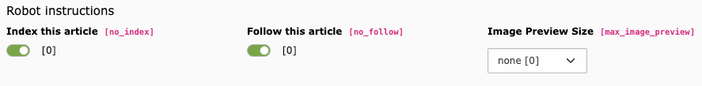

# TYPO3 Extension `news_seo`

This extension provides additional SEO features to EXT:news

- Fields `no_index` & `no_seo` to control robot information per article and to override robot information of the page record
- Image preview information `max-image-preview` ([documentation](https://developers.google.com/search/docs/crawling-indexing/robots-meta-tag#max-image-preview))
- Set canonical tag even if `no_index` is set on page level
- Field for a canonical link



## Requirements

- PHP 7.4+
- TYPO3 10/11/12 with core extension "seo" installed
- EXT:news 8.6/9/10/11

## Installation

Either use `composer require georgringer/news-seo` or install the extension via Extension Manager.

## Usage

### Exclude news from sitemap

Add the following snippet to your TypoScript

```typo3_typoscript
plugin.tx_seo.config.xmlSitemap.sitemaps {
    # Important: the key might differ in your setup!
    news {
        config.additionalWhere = {#type} NOT IN(1,2) AND {#no_index}=0
    }
}
```

### Robots tag

The robots tag is automatically generated by the extension

## Thanks

The initial development of this extension has been paid by MENNEKES Elektrotechnik GmbH & Co. KG - www.mennekes.de
❤️Thanks a lot!
